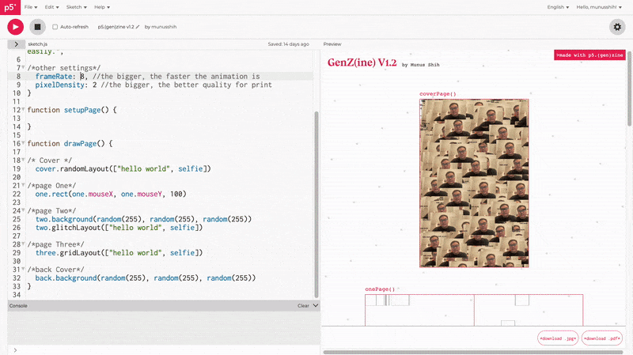
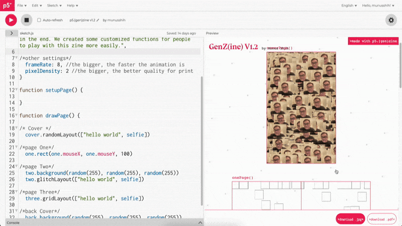
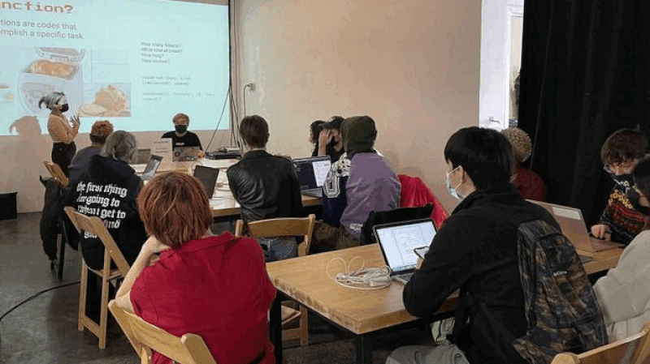

# [p5.genzine](https://munusshih.github.io/p5.genzine/)

p5.(gen)Zine is an open-sourced and friendly library created by [Munus Shih](https://munusshih.com) and [Iley Cao](https://www.ileycao.com/) for anyone curious about creative code and zine-making. 



It utilizes the p5.js library to experiment with collaborative zine-coding, forking, remixing and explore what generative coded zine can do to contribute to community building.

**CURRENT STATUS**: `v1.2` is in beta. Please feel free to send issues or pull request us!

## Getting Started


Easily import the p5.js and p5.genzine library and start making your own zine!

```HTML
<script src="https://cdnjs.cloudflare.com/ajax/libs/p5.js/1.6.0/p5.js"></script>
<script src="https://munusshih.github.io/p5.genzine/p5.(gen)zine.js"></script>
<script src="sketch.js"></script>
```
We will put the below starter code below in our `sketch.js` so we have something in our code.

```Javascript
const zine = {
  title: "Insert Title Here",
  author: "Your Beautiful Name",
  description: "Your first p5.genzine!"
}

function setupPage() {
// This replaces the old p5 setup()
}

function drawPage() {
// This replaces the old p5 draw()
}
```

See the [Quick start](intro/quickstart.md) guide for more details.

## Other Tutorials & Resources



- You can play with [this interactive documentation]() in OpenProcessing (not finished!)
- You can find the recording of a workshop we taught at 2022's Virtual Creative Coding Festival [here](https://www.youtube.com/watch?v=lAQc3Ij3O8k&ab_channel=ProcessingFoundation).
- [This is the link](https://docs.google.com/presentation/d/1EJhxkK4Y07TfD7r6gUuXITqdYWmzFHE_BbPqNvFViuM/edit?usp=sharing) to our slides we used to teach `function` and `p5.gen(zine)` at POWRPLNT.
- [There is the link](https://docs.google.com/presentation/d/1VEQN4Ro4POYxDtKL6aLBGOjlln6rnFerCH_ebJS2VUE/edit?usp=sharing) to the talk that Munus gave at 2023's Open Source Art Contributor's Conference.