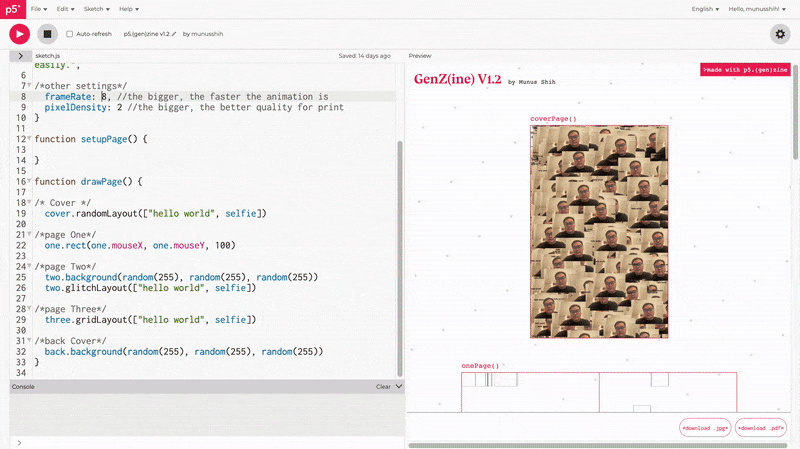
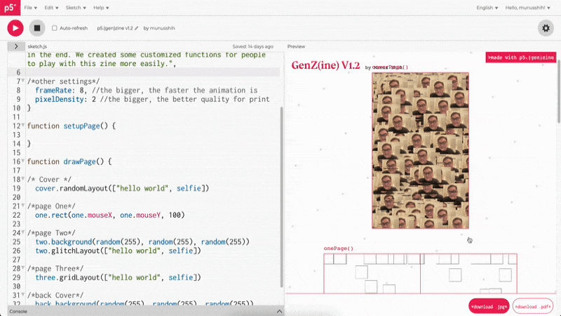
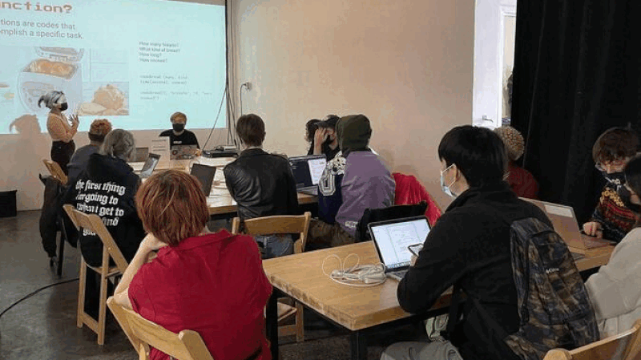

# [p5.zine](https://munusshih.github.io/p5.genzine/)

p5.(gen)Zine is an open-sourced and friendly library created by [Munus Shih](https://munusshih.com) and [Iley Cao](https://www.ileycao.com/) for anyone curious about creative code and zine-making. 



It utilizes the p5.js library to experiment with collaborative zine-coding, forking, remixing and explore what generative coded zine can do to contribute to community building.

**CURRENT STATUS**: I'm currently working on a revamped version that works with p5 2.0, and will use the regular p5 `setup` and `draw` cycle, instead of the current custom version: https://github.com/munusshih/p5.zine, but this still needs more love so feel free to give it some tests!

## Templates

Here are some templates to quick start!
- [Very Simple p5.genzine template](https://openprocessing.org/@u261940/1897656)
- [A fun interactive zine feature Processing-themed Stretch](https://openprocessing.org/@u261940/1898736)
- [A p5.genzine tutorial made with p5.genzine](https://openprocessing.org/@u261940/1926277)

## Getting Started


Easily import the p5.js and p5.genzine library and start making your own printable and shareable 8 page coded zine!

```HTML
<script src="https://cdnjs.cloudflare.com/ajax/libs/p5.js/1.6.0/p5.js"></script>
<script src="https://munusshih.github.io/p5.genzine/p5.(gen)zine.js"></script>
<script src="sketch.js"></script>
```
We will put the below starter code below in our `sketch.js` so we have something in our code.

```Javascript
const zine = {
  title: "Insert Title Here",
  author: "Your Beautiful Name",
  description: "Your first p5.genzine!"
}

function setupPage() {
// This replaces the old p5 setup()

/* Cover */
  cover.randomLayout(["hello world", selfie])
}

function drawPage() {

// This replaces the old p5 draw()

/*page One*/

// you add a page object like cover, one, two, three or back to specify where you want the function draw. The rest is typical p5 language!
  one.rect(one.mouseX, one.mouseY, 100)

/*page Two*/
  two.background(random(255), random(255), random(255))
  two.glitchLayout(["hello world", selfie])

/*page Three*/
  three.gridLayout(["hello world", selfie])

/*back Cover*/
  back.background(random(255), random(255), random(255))
}
```

## Community Resources and Inputs



Here are some beautiful zines made by people:
- [A beautiful p5.zine made by Lavannya Suressh](https://openprocessing.org/@u261940/1926419)
- [A zine with inputs from Pratt ComD students](https://openprocessing.org/@u261940/2814003)
- [A generative zip workshop on reimagining home with Artist Tzuyun Wei](https://drive.google.com/drive/folders/1la1zmCLlDt7F7Z29QzQ57fWiAAnbz0_C?usp=drive_link), all zines generated from this [p5.genzine](https://openprocessing.org/@u261940/2803502)

Here are some teaching materials made by others:
- [A documented tutorial created by @computationalmama](https://github.com/ajaibghar-co/generative-zine-jam/blob/main/gen-zine-instructions.md), hosted in India.
- You can find the recording of a workshop we taught at 2022's Virtual Creative Coding Festival [here](https://www.youtube.com/watch?v=lAQc3Ij3O8k&ab_channel=ProcessingFoundation).

## Featured

- [Code, Decolonized × POWRPLNT Symposium — Processing Foundation (2022)](https://processingfoundation.org/blog/code-decolonized-x-powrplnt-symposium-2022/)  
- [Processing Foundation Software Showcase](https://www.processingfoundation.org/software/showcase/)  
- [PrePostPrint Resources](https://prepostprint.org/resources/), included as an open-source tool and workshop resource for experimental web-to-print publishing.
- [Algorave India — Compilation One](https://music.algorave.in/compilation-one/about.html), used by the code.drift collective to create generative zines accompanying the compilation.
- [Zine Making with Creative Coding — New Media Art Club (2026)](https://www.newmediaart.club/p/zine-making-with-creative-coding), used in a creative coding and zine-making workshop in Leicester, UK.

To read more about the development and research behind the library in [*p5.genzine: Zine as Coding Connectivity*](https://munusshih.github.io/p5-genzine-thesis/).
