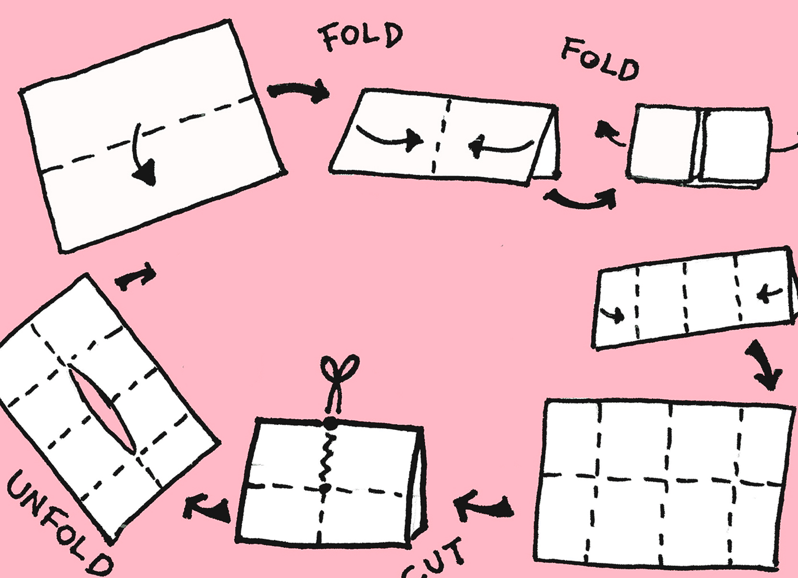

# p5.genzine <small>v1.2</small>

> A p5.js library for zine-coding

- Simple and lightweight
- No statically built html files
- Multiple themes

[GitHub](https://github.com/munusshih/p5.genzine)
[Quick Start](intro/quickstart)

<!-- background image -->

<!-- background color -->

